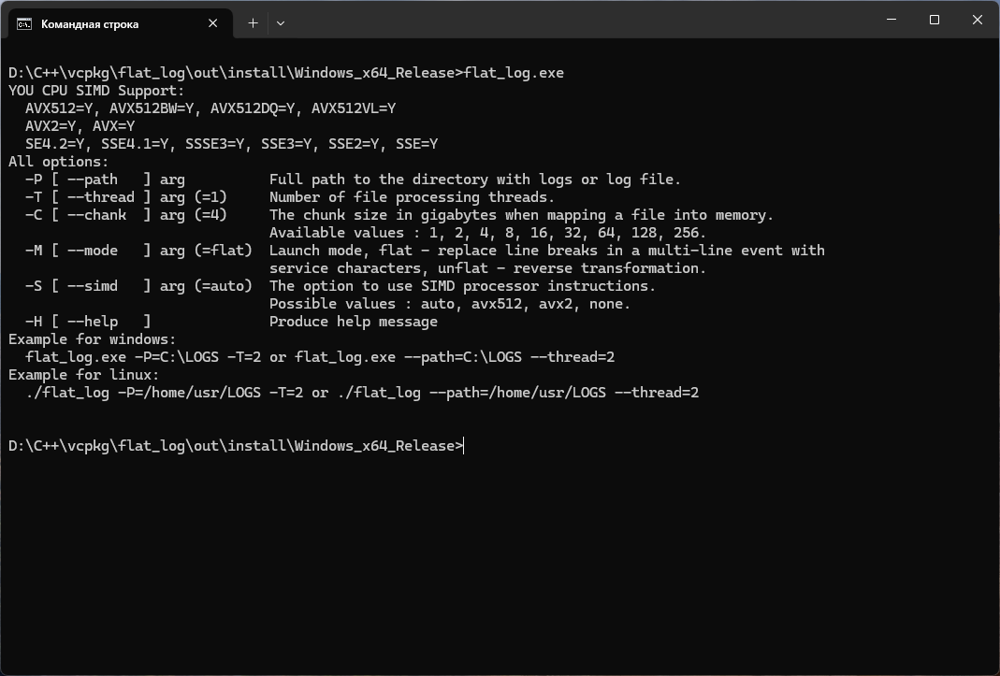
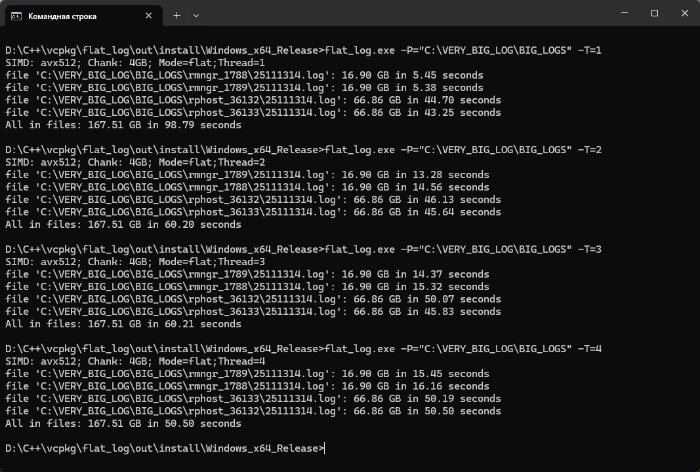

Консольная утилита преобразует многострочное событие технологического журнала в однострочное.
Заменяет в исходном файле символы \r и \n на символы с кодами 0x01 и 0x02.
Обработка производится через проецированием частей файлов в память (обрабатываются файлы много больше доступной оперативной памяти).
Для анализа нахождения символов переноса и завершения строки используются возможности современных процессоров - SIMD инструкции.
Поддерживаются следующие режимы: avx512, avx2 и none. При обработке файлов доступен многопоточный режим запуска.

Справка по запуску утилиты

Результаты теста производительности
